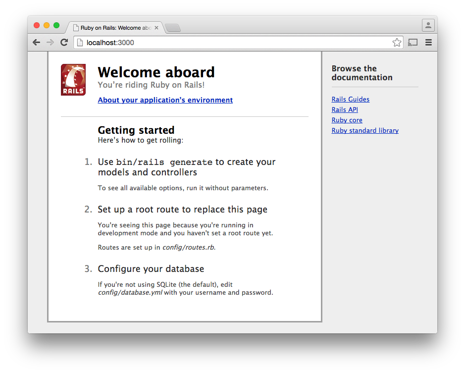
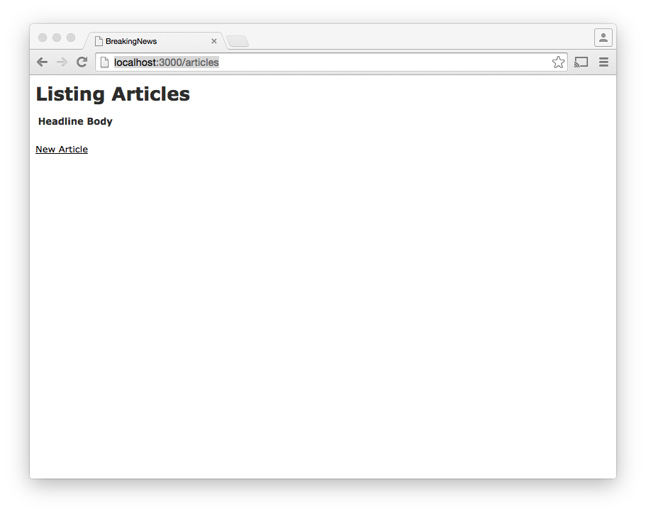

# AJAX

AJAX stands for Asynchronous JavaScript and XML. AJAX is a term used to describe a method of updating the contents of a web page without reloading the entire page. While AJAX has XML in the name, this method is not restricted to that format. Modern web applications use a format known as JavaScript Object Notation (JSON). 

The following diagrams give a visual representation of traditional web requests and AJAX calls.


Source: http://www.xml.com/lpt/a/1622

We will be looking at two different ways of making AJAX calls within Rails. Firstly we will fetch JSON formatted data from the server and use that to update the page. 

The second method we will use is fetching a snippet of HTML from the server and then rendering that on the page. 

In both scenarios the page will get updated without us needing to refresh the page. We will be doing this work in a new project called 'Breaking News'.

## Breaking News

We will be doing this work in the context of a news site called 'Breaking News'. The main resource in the project will be a news article. let's begin by creating a new project. 

### Creating Breaking News

Make sure you are at your development root - i.e. a good location to create a new Rails project, so that you are not going to end up with nested Git folders.


To create the Rails application type:

```
rails new breaking_news
```

Start the rails server: 

```
rails s
```

Navigate to `http://localhost:3000/` and you should see the initial setup screen:



Next we add this to a local git repo:

```
dev $ cd breaking_news/
breaking_news $ git init
Initialized empty Git repository in /Users/daryn/dev/breaking_news/.git/
breaking_news $ git add -A
breaking_news $ git commit -m "Initial check in"

```

From this point on you are expected to commit your work on a regular basis. If you want to commit it to GitHub please ask for help.

### Scaffolding 

In the past we have used commands such as `rails generate model title:string body:text`. This uses the 'model' generator. Now we are going to use a new generator called 'scaffold'. Use the following command to see how it works:

```
breaking_news $ rails generate scaffold --help
```

This brings up help content wich includes the following:

```
Scaffolds an entire resource, from model and migration to controller and views, along with a full test suite. The resource is ready to use as a starting point for your RESTful, resource-oriented application.
```

The following examples are given:

```
Examples:
    `rails generate scaffold post`
    `rails generate scaffold post title body:text published:boolean`
    `rails generate scaffold purchase amount:decimal tracking_id:integer:uniq`
    `rails generate scaffold user email:uniq password:digest`
```

We want an article resource in our application and we can generate this with the following command:

```
rails generate scaffold article headline:string body:text
```

This command has created a controller, views, a model, and a migration. Before we can see it in action we need to run the migration:

```
rake db:migrate
```

Next we can see which routes we have:

```
breaking_news $ rake routes
      Prefix Verb   URI Pattern                  Controller#Action
    articles GET    /articles(.:format)          articles#index
             POST   /articles(.:format)          articles#create
 new_article GET    /articles/new(.:format)      articles#new
edit_article GET    /articles/:id/edit(.:format) articles#edit
     article GET    /articles/:id(.:format)      articles#show
             PATCH  /articles/:id(.:format)      articles#update
             PUT    /articles/:id(.:format)      articles#update
             DELETE /articles/:id(.:format)      articles#destroy

```

We can now use the application by browsing to `http://localhost:3000/articles`. This should show the following screen:



You can now use this application to add articles.

One change we should make is to make the headline and body required fields. Open the article model and make these two fields required.

```ruby
# app/models/article.rb

class Article < ActiveRecord::Base
	validates :headline, :body, presence: true
end

```

Experiment by trying to add an article without a headline or body.


### Seed the database

We would like to add some test data so that we have some content to work with. We can do this by opening `seeds.rb` and adding the following lines:

```ruby
# db/seeds.rb
Article.create([{ headline: 'Ruby', body: 'Ruby is a great programming language' }, 
	{ headline: 'JavaScript', body: 'JavaScript adds Jazz Hands to a website' },
	{ headline: 'Java', body: 'Java technology allows you to work and play in a secure computing environment. ' },
	{ headline: 'PHP', body: 'PHP is a server-side scripting language designed for web development but also used as a general-purpose programming language.' },
	{ headline: 'Python', body: 'Python is a programming language that lets you work quickly
and integrate systems more effectively.' },
	{ headline: 'C#', body: 'C# (pronounced as see sharp) is a multi-paradigm programming language.' },])
```

To add this data to the database we can run `rake db:seed`. However we may want to get rid of previous data first, to do that we run the following:

```
breaking_news $ rake db:reset
```
This will reload the database scheme by running the migrations, and then run the seeds file.

Note: I needed to restart my Rails server to see the changes. 

More information can be found here: https://codedecoder.wordpress.com/2013/04/25/rake-db-seed-in-rails/


Pro-tip: Commit your work to Git


Reference:
* http://www.korenlc.com/rails-generate-model-vs-resourse-vs-scaffold/
