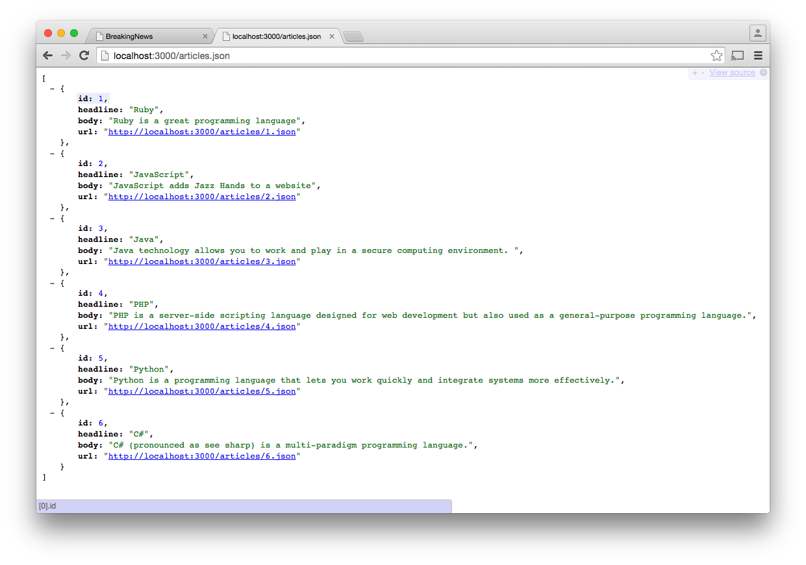

# Rails as an API

The goal is to start making AJAX calls from an HTML page running in the browser. The page will make requests to the server. The server will return data in the form of JSON. The client will then display this on a page. 

## Responding as an API

This means that the server needs to act as an API responding in JSON instead of generating an HTML response. It may surprise you to know that 'breaking_news' can already be used as an API. Try going to the following URL: `http://localhost:3000/articles.json`. That should display JSON similar to this:



The reason this works is because we have appended `.json` onto the request. This informs the controller that we are requesting JSON. This changes the behavior of the actions. Now the `index` action does not render `app/views/index.html.erb`, instead it uses `app/views/index.json.builder` to return JSON.

The json.builder functionality comes from a gem called jbuilder. This is a fairly recent gem and it was written by the creator of Rails, David Heinemeier Hansson (DHH). For more details on jbuilder see these resources:

* jbuilder - https://github.com/rails/jbuilder
* RailsCasts - http://railscasts.com/episodes/320-jbuilder


### respond_to

In the Articles Controller, the `create`, `update`, and `destroy` actions don't have matching view templates or jbuilder templates. For example when a user submits an HTML form to create an article they are redirected to the 'article_path' which calls the `show` action and renders the show view. 

If a user posts data to `/articles.json` then it does not make sense to respond with a redirect - this is because the client was most likely an AJAX client which is trying to avoid a page refresh. Instead this action should return the article data and a an HTTP status code of 201 indicating that the resource was created.  

The `create` action code looks quite daunting. This is because of the odd looking `respond_to` method. The way to think about this is like a `case statement` (or `if, else if`). 

```ruby
  # POST /articles
  # POST /articles.json
  def create
    @article = Article.new(article_params)

    respond_to do |format|
      if @article.save
        format.html { redirect_to @article, notice: 'Article was successfully created.' }
        format.json { render :show, status: :created, location: @article }
      else
        format.html { render :new }
        format.json { render json: @article.errors, status: :unprocessable_entity }
      end
    end
  end
```

If `@article.save` returns `true`, then either `format.html` or `format.json` will be invoked - not both. Similarly if `@article.save` returns `false` only `format.html` or `format.json` will be invoked. These format "methods" then return the correctly formatted response, in this case it is either HTML or JSON.

#### References

* http://api.rubyonrails.org/classes/ActionController/MimeResponds.html
* http://stackoverflow.com/questions/9492362/rails-how-does-the-respond-to-block-work
* http://www.restapitutorial.com/httpstatuscodes.html


